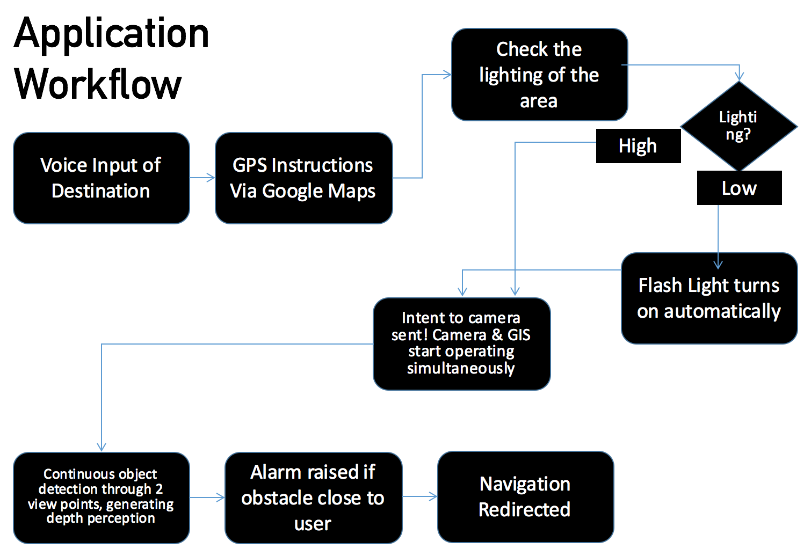
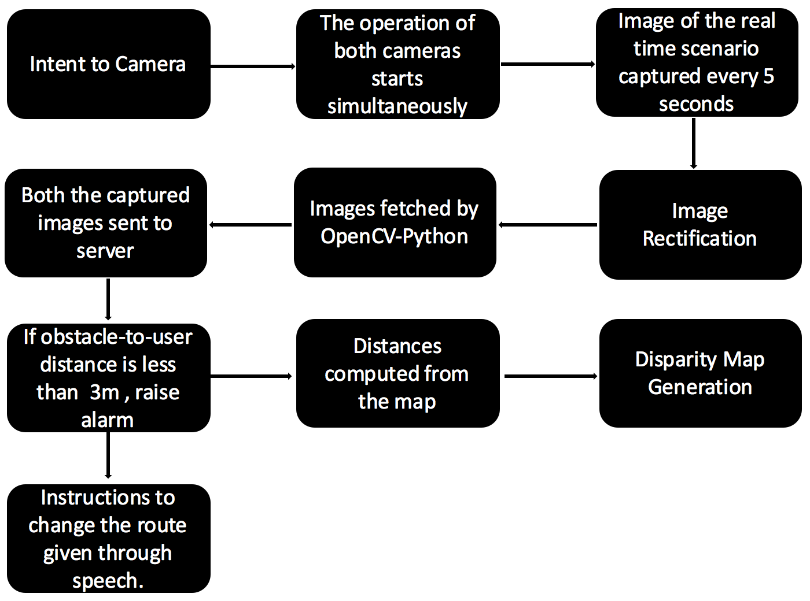
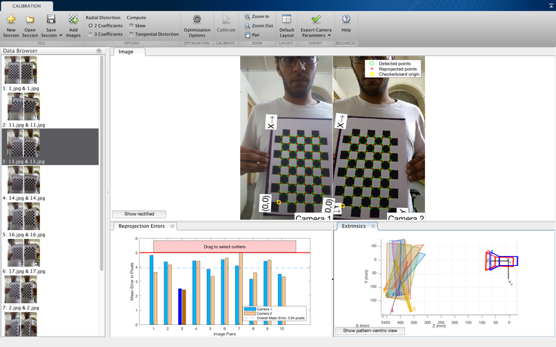
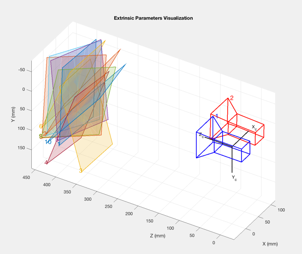
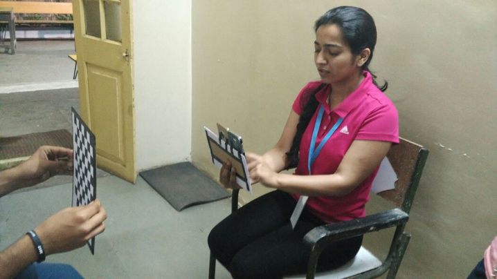
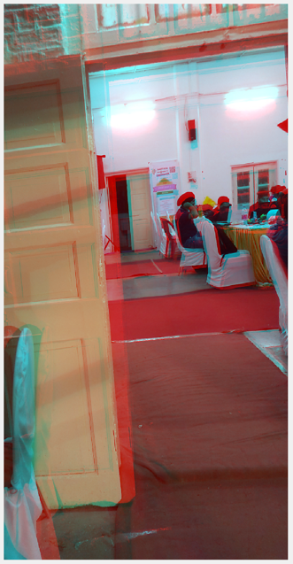
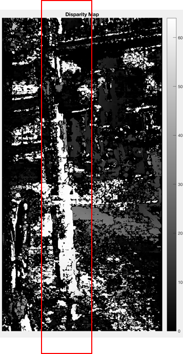
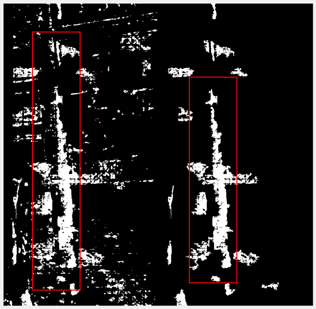

# Smart India Hackathon 2018

## Drishti, Obstacle Detection using Stereo Vision

Co-authors of the project: <a href="https://github.com/mayank408/">Mayank Tripathi</a>, <a href="https://github.com/ashu10832">Ashu Gupta</a>, <a href="https://github.com/shubhi-sareen"> Shubhi Sareen </a>, Snighda Hasija

This project is used to detect obstacles by creating a depth map using 2 images clicked simultaneously from 2 Android phones placed side by side after every 3 seconds.
On one mobile this app is installed and on the other, the Admin app is installed. Images are stored in Firebase Realtime Database and are fetched from the server which processes both images and find the obstacles.
This project was proposed in **Smart India Hackathon'17** Pune and was awarded **1st Prize**.

### Calibration of the RIG

|  |  |  |
| --- | --- | --- |

### Callibration Test

|  |  |  |
| --- | --- | --- |
